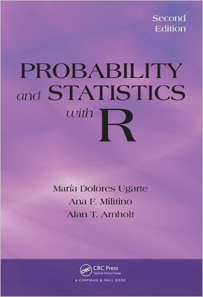

# PASWR2E-Rscripts

[](http://www.amazon.com/Probability-Statistics-R-Second-Edition/dp/1466504390/ref=dp_ob_title_bk)

R scripts for the book [*Probability and Statistics with R, Second Edition*](http://alanarnholt.github.io/PASWR2E-Book/)

### Quick Links 

* R package [PASWR2](http://alanarnholt.github.io/PASWR2/) supports the text
* [Odd answers](http://alanarnholt.github.io/PASWR2E-Book/PASWR2EMODDforWEB.pdf)
* [Homework Examples](https://github.com/alanarnholt/Homework-Examples)
* [Cloning Repo Video](https://github.com)

### Downloading Chapter Scripts

* Click on the ChapterScripts directory
* Select the desired chapter
* Click the **Raw** button (top right)
* In your web browser, click **Edit > Select All** then **Edit > Copy**
* Paste the results in a blank R script OR
* Copy the url and use `download.file()` (example below)

```
# Downloading Chapter One Script
site <- "https://raw.githubusercontent.com/alanarnholt/PASWR2E-Rscripts/master/ChapterScripts/chapter01.R"
download.file(url = site, destfile = "chapter01.R")
```

